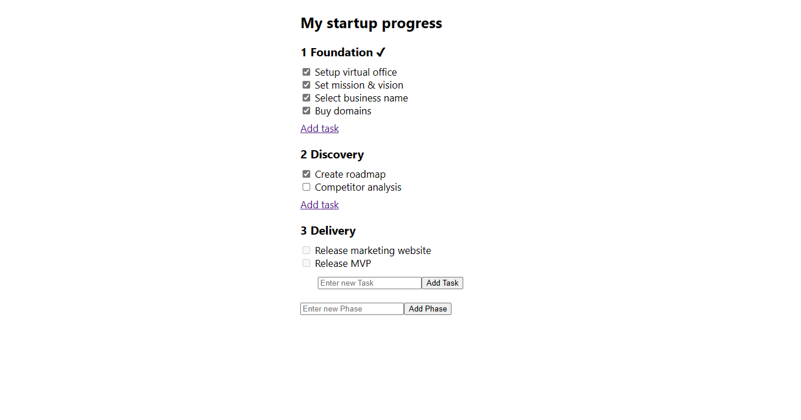

# Startup Todo - OAK'S LAB Audition Assignment

The application allows you to create your own Todo phases and tasks as befitting for your startup and saves the data and progress to local storage.

## To run

- Clone with `git clone https://github.com/Chizaram-Igolo/Startup-Todo.git`
- `cd` into folder
- Install all dependencies with `npm install`
- Start application with `npm start` and navigate to `localhost:3000` (or available port) on your browser.

## Application Screenshot



## Product Specification

A TODO application that:

- Can have an unlimited amount of tasks.
- Unlocks the next phase only when ALL tasks in the previous phases are accomplished.
- Stores the progress in local storage.
- Displays a random fact from provided URL after all phases are completed.
- Uses TypeScript for type-checking.

## Proposal and Implementation for Reopening/Undoing a Task

- I retrieve the state from the local memory.

```
function handleUpdateTask(phaseId: number, taskId: number) {
    const localTodoObj = getLocalTodoObj() as IPhaseObj[];
```

```
// Helper function for retrieving local state.
function getLocalTodoObj() {
    return JSON.parse(window.localStorage.getItem("todoObj") as string);
}
```

- I find the specific **phase** and specific **task** and toggle the `done` property of the task base on its previous boolean value.

```
// Find the phase
const phaseIdx = localTodoObj.findIndex((todo) => todo.id === phaseId);
const localPhase = localTodoObj[phaseIdx];

// Find the task
const taskIdx = localPhase.tasks.findIndex((task) => task.id === taskId);
const localTask = localPhase.tasks[taskIdx];

if (!localTask.done) {
    localTask.done = true;
} else {
    localTask.done = false;
}

```

- I update the application state and the local memory to reopen/undo a task.

```
// Update the task and phase.
localPhase.tasks[taskIdx] = localTask;
localTodoObj[phaseIdx] = localPhase;

window.localStorage.setItem("todoObj", JSON.stringify(localTodoObj));

// Update application state
setTaskVal("");
setTodoObj(JSON.parse(window.localStorage.getItem("todoObj") as string));
```

- I make sure to pass the phase id and task id from the component (needed to find the task that needs to be reopened/undone) to `handleUpdateTask`.

```
<input
    type="checkbox"
    id="doneStatus"
    name="doneStatus"
    checked={t.done || false}
    onChange={() => handleUpdateTask(i.id, tIdx)}

    ...
/>
```

## Stack

- React
- TypeScript

Thank you.
